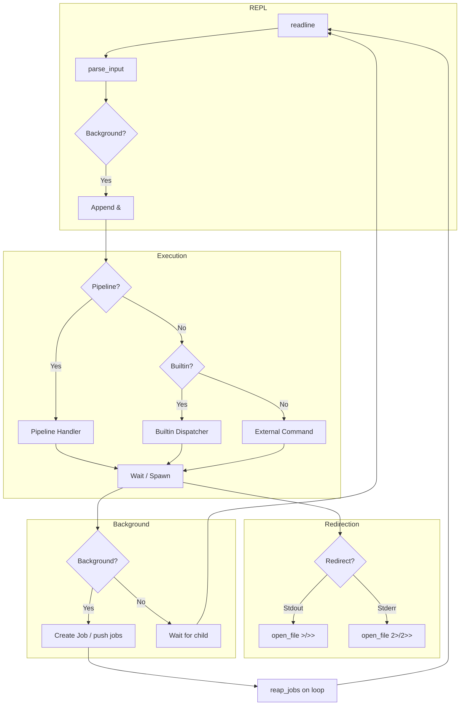

[](https://app.codecrafters.io/users/codecrafters-bot?r=2qF)

# Build Your Own Shell

A POSIX-compliant shell implementation in Rust, built as part of the [CodeCrafters "Build Your Own Shell" Challenge](https://app.codecrafters.io/courses/shell/overview).

## Features

### Builtin Commands

- [x] `echo` — Print arguments to stdout
- [x] `exit` — Exit the shell
- [x] `pwd` — Print current working directory
- [x] `cd` — Change directory (supports `~` for HOME)
- [x] `type` — Display command type (builtin or external with path)
- [x] `declare` — Declare and inspect shell variables (`declare -p name`, `declare name=value`)
- [x] `complete` — Register, remove, and query custom tab completers (`-C`, `-r`, `-p`)
- [x] `jobs` — List background jobs with status (Running / Done)
- [x] `history` — View, read (`-r`), write (`-w`), and append (`-a`) command history

### Shell Features

- [x] **External command execution** — Run any program in PATH
- [x] **Tab completion** — Builtins, executables in PATH, filesystem paths
- [x] **Custom completers** — Register completion scripts via `complete -C`
- [x] **Pipe support (`|`)** — Chain commands; works across builtins and external programs
- [x] **Output redirection** — `>`, `>>`, `1>`, `1>>`, `2>`, `2>>`
- [x] **Background jobs (`&`)** — Run commands in background with job tracking
- [x] **Variable expansion** — `$var` and `${var}` syntax
- [x] **Quoting** — Single quotes, double quotes, and escape characters
- [x] **Command history** — Persistent history via `HISTFILE` environment variable
- [x] **Job reaping** — Automatic cleanup of completed background jobs

## Architecture



## Getting Started

1. Ensure you have [Cargo (1.95+)](https://rustup.rs/) installed
2. Run `./your_program.sh` to start the shell
3. Run `codecrafters submit` to submit your solution to CodeCrafters

```
$ ./your_program.sh
$ echo "hello world"
hello world
$ pwd
/home/user/project
$ ls -la | grep README
```
